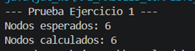
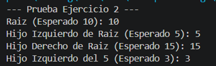
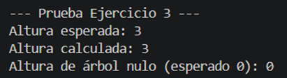
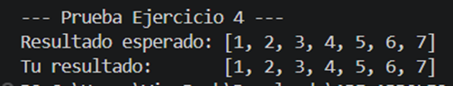
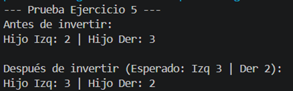

# Práctica APE - Estructuras de Datos: Árboles

**Facultad:** Ingeniería en Sistemas, Electrónica e Industrial

**Estudiante:** Shirley Amaguaña  
**Carrera:** Software  
**Asignatura:** Estructura de Datos  
**Tema:** Árboles

---

## Descripción

Práctica enfocada en la implementación de árboles N-arios y Binarios, cubriendo inserción en BST, cálculo de altura, recorridos InOrder y transformación espejo. Los ejercicios están resueltos en **C++** y **Java**.

---

## Objetivos de Aprendizaje

Al completar estos ejercicios, serás capaz de:

1. Comprender y manipular la estructura básica de nodos con múltiples hijos y nodos binarios.
2. Implementar la lógica de inserción en un Árbol Binario de Búsqueda (BST).
3. Utilizar la recursividad para calcular métricas estructurales, como la profundidad máxima.
4. Extraer datos mediante recorridos estándar (In-Order).
5. Modificar la estructura de punteros para transformar un árbol en su espejo.

---

## Estructura del Proyecto

```
APE_ARBOLES/
│
├── cpp/
│   ├── Ejercicio1_Basico.cpp         → Conteo de nodos en árbol N-ario
│   ├── Ejercicio2_Binario.cpp        → Inserción en BST
│   ├── Ejercicio3_Binario.cpp        → Altura del árbol binario
│   ├── Ejercicio4_Recorridos.cpp     → Recorrido InOrder
│   └── Ejercicio5_Transformacion.cpp → Árbol espejo
│
├── java/
│   ├── Ejercicio1_Basico.java        → Conteo de nodos en árbol N-ario
│   ├── Ejercicio2_Binario.java       → Inserción en BST
│   ├── Ejercicio3_Binario2.java      → Altura del árbol binario
│   ├── RecorridoInOrder.java         → Recorrido InOrder
│   └── Ejercicio5_Transformacion.java→ Árbol espejo
│
├── informe/
│   └── Informe_APE_Arboles_Shirley.docx
│
└── README.md
```

---

## Ejercicios

| # | Tema | Concepto clave |
|---|------|----------------|
| 1 | Árboles N-arios | Conteo recursivo de nodos |
| 2 | BST - Inserción | Menores a la izq, mayores a la der |
| 3 | Árbol Binario | Altura máxima con recursividad |
| 4 | Recorridos | InOrder: izq → raíz → der |
| 5 | Transformación | Espejo intercambiando hijos |

---

## Cómo ejecutar

### C++
```bash
g++ -o ejercicio1 cpp/Ejercicio1_Basico.cpp
./ejercicio1
```

### Java
```bash
# Ejercicio 1 (independiente)
javac java/Ejercicio1_Basico.java
java -cp java Ejercicio1_Basico

# Ejercicios 2-5 (dependen de la clase Nodo del Ejercicio 2)
javac java/Ejercicio2_Binario.java java/Ejercicio3_Binario2.java
java -cp java Ejercicio3_Binario2
```

---

## Capturas de ejecución

**Ejercicio 1**



**Ejercicio 2**



**Ejercicio 3**



**Ejercicio 4**



**Ejercicio 5**



---

## Instrucciones para el Desarrollo

1. Dentro de cada archivo encontrarán la estructura básica de las clases (o structs) y la definición de un método específico que deben completar. 
2. Localicen el comentario `TODO: Implementa tu lógica aquí`. Esa es la única sección del código que necesitan modificar.
3. No es necesario modificar el método `main`. Este método ya contiene la construcción de un árbol de prueba y las impresiones necesarias para validar que su algoritmo funciona correctamente.
4. Su objetivo es lograr que, al ejecutar el código, los resultados calculados coincidan con los resultados esperados impresos en la consola.
